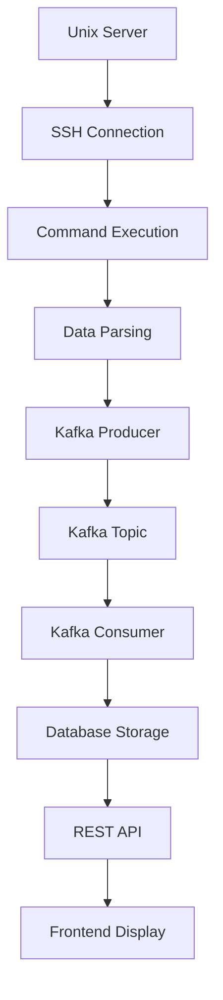
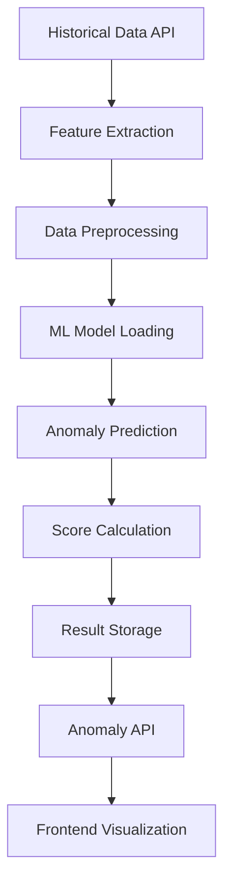
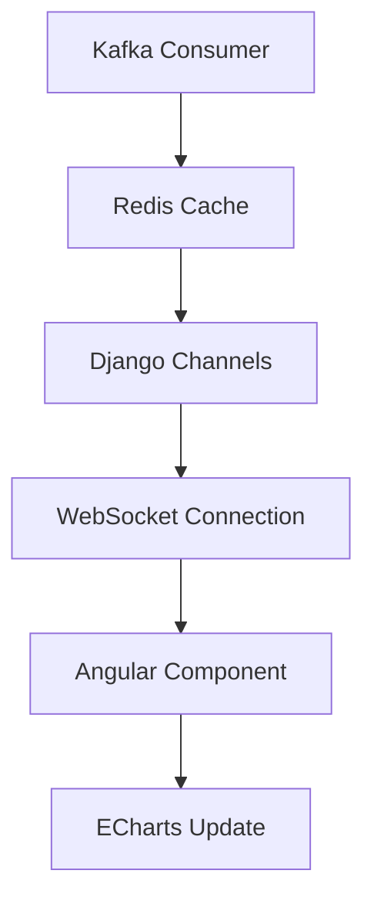

# HPS Dashboard - Smart Resource Monitoring System

## 📋 Table of Contents

1. [Project Overview](#project-overview)
2. [System Architecture](#system-architecture)
3. [Application Separation Strategy](#application-separation-strategy)
4. [Core Components](#core-components)
5. [Data Flow](#data-flow)
6. [API Documentation](#api-documentation)
7. [Database Schema](#database-schema)
8. [Deployment Guide](#deployment-guide)
9. [Development Setup](#development-setup)
10. [Features Overview](#features-overview)

---

## 🎯 Project Overview

HPS Dashboard is a comprehensive smart resource monitoring system for Unix servers that provides:

- **Real-time Monitoring**: Live server metrics collection and visualization
- **Historical Analysis**: Long-term data storage and trend analysis  
- **Anomaly Detection**: ML-powered anomaly detection with isolation forest algorithms
- **Scalable Architecture**: Kafka-based data collection with dynamic server discovery
- **Prediction Models**: Future resource usage forecasting
- **CRUD Management**: Complete server administration interface

### 🏗️ Technology Stack

**Backend:**
- Django 5.2.1 with Django REST Framework
- PostgreSQL 16 for data persistence
- Redis 7.0 for caching and session management
- Apache Kafka 7.3.0 for scalable data streaming
- Docker & Docker Compose for containerization

**Frontend:**
- Angular 15+ with ngx-admin template
- ECharts for data visualization
- Nebular UI component library
- TypeScript for type safety

**Machine Learning:**
- scikit-learn for anomaly detection models
- Isolation Forest algorithms
- StandardScaler for feature normalization
- joblib for model serialization

**Infrastructure:**
- Docker Compose for local development
- Supervisor for process management
- Oracle Instant Client for enterprise database support

---

## 🏛️ System Architecture

### High-Level Architecture

```
┌─────────────────┐    ┌─────────────────┐    ┌─────────────────┐
│   Unix Servers  │    │   Data Layer    │    │  Application    │
│                 │    │                 │    │     Layer       │
│ ┌─────────────┐ │    │ ┌─────────────┐ │    │ ┌─────────────┐ │
│ │   vmstat    │ │───▶│ │    Kafka    │ │───▶│ │   Django    │ │
│ │   iostat    │ │    │ │   Topics    │ │    │ │   Backend   │ │
│ │   netstat   │ │    │ │             │ │    │ │             │ │
│ │  processes  │ │    │ └─────────────┘ │    │ └─────────────┘ │
│ └─────────────┘ │    │                 │    │                 │
│                 │    │ ┌─────────────┐ │    │ ┌─────────────┐ │
│ ┌─────────────┐ │    │ │ PostgreSQL  │ │    │ │   Angular   │ │
│ │ SSH Agents  │ │    │ │  Database   │ │    │ │  Frontend   │ │
│ │             │ │    │ │             │ │    │ │             │ │
│ └─────────────┘ │    │ └─────────────┘ │    │ └─────────────┘ │
└─────────────────┘    │                 │    │                 │
                       │ ┌─────────────┐ │    │ ┌─────────────┐ │
                       │ │    Redis    │ │    │ │ ML Models   │ │
                       │ │   Cache     │ │    │ │  (joblib)   │ │
                       │ │             │ │    │ │             │ │
                       │ └─────────────┘ │    │ └─────────────┘ │
                       └─────────────────┘    └─────────────────┘
```

### Microservice Architecture

The system is designed with a modular microservice approach:

```
┌──────────────────────────────────────────────────────────────┐
│                    HPS Dashboard System                       │
├──────────────────────────────────────────────────────────────┤
│                     Django Backend                            │
│                                                              │
│  ┌─────────────┐  ┌─────────────┐  ┌─────────────┐          │
│  │   Metrics   │  │   Anomaly   │  │   Models    │          │
│  │     App     │  │     App     │  │     App     │          │
│  │             │  │             │  │             │          │
│  │ • Servers   │  │ • Detection │  │ • Legacy    │          │
│  │ • Metrics   │  │ • Results   │  │ • Reports   │          │
│  │ • Real-time │  │ • Runs      │  │ • Utils     │          │
│  │ • Historic  │  │ • Thresholds│  │             │          │
│  └─────────────┘  └─────────────┘  └─────────────┘          │
│         │               │               │                   │
├─────────┼───────────────┼───────────────┼───────────────────┤
│         ▼               ▼               ▼                   │
│  ┌─────────────────────────────────────────────────────────┐ │
│  │                 Shared Data Layer                       │ │
│  │                                                         │ │
│  │  PostgreSQL  │  Redis Cache  │  Kafka Streams          │ │
│  └─────────────────────────────────────────────────────────┘ │
└──────────────────────────────────────────────────────────────┘
```

---

## 🔧 Application Separation Strategy

### Why Separation Was Necessary

The original system had anomaly detection mixed with the metrics app, creating:
- **Tight Coupling**: Anomaly logic embedded in metrics views
- **Code Pollution**: ML code mixed with data collection logic
- **Poor Scalability**: Difficult to extend or modify anomaly features
- **Testing Complexity**: Hard to test anomaly detection independently

### Separation Architecture

I implemented a **clean separation strategy** that divides the system into specialized Django apps:

#### 🎯 **Metrics App** (Core Infrastructure)
```python
metrics/
├── models.py          # Server, base metric models
├── views.py           # Data collection, real-time APIs
├── consumers/         # Kafka consumers
├── producers/         # Kafka producers  
├── management/        # Data collection commands
└── utils/             # SSH, parsers, utilities
```

**Responsibilities:**
- Server registration and management
- Real-time metrics collection
- Historical data APIs
- Kafka integration
- SSH connections to monitored servers

#### 🤖 **Anomaly App** (ML & Detection)
```python
anomaly/
├── models.py          # AnomalyDetectionResult, AnomalyDetectionRun, AnomalyThreshold
├── views.py           # ML inference, detection APIs
├── mlmodels/          # Trained ML models (joblib files)
├── admin.py           # Admin interface for anomaly data
└── apps.py            # App configuration
```

**Responsibilities:**
- Machine learning model management
- Anomaly detection algorithms
- Results storage and retrieval
- Detection run tracking
- Threshold configuration

#### 📊 **Models App** (Legacy & Reports)
```python
models/
├── models.py          # Legacy models, reports
├── views.py           # Report generation
└── utils.py           # Report utilities
```

**Responsibilities:**
- Legacy model support
- Report generation
- Historical analysis utilities

### 🔗 Integration Strategy

The apps are connected through **loose coupling** with clear interfaces:

```python
# Foreign Key Relationships
class AnomalyDetectionResult(models.Model):
    server = models.ForeignKey(
        'metrics.Server',  # Reference to metrics app
        on_delete=models.CASCADE,
        related_name='anomaly_results'
    )
```

**Key Integration Points:**

1. **Database Relations**: Foreign keys link anomaly results to servers
2. **API Calls**: Anomaly app calls metrics APIs for historical data
3. **Shared Settings**: Common configuration in Django settings
4. **URL Routing**: Separate namespaces (`/api/metrics/`, `/api/anomaly/`)

---

## 🔩 Core Components

### 1. Data Collection Engine

**Kafka-based Streaming Architecture:**
```
Unix Server → SSH Agent → Kafka Producer → Kafka Topic → Consumer → PostgreSQL
```

**Collectors:**
- **VMStat Collector**: CPU, memory, swap metrics
- **IOStat Collector**: Disk I/O statistics
- **NetStat Collector**: Network interface metrics  
- **Process Collector**: Running process information

### 2. Anomaly Detection Engine

**ML Pipeline:**
```
Historical Data → Feature Extraction → Normalization → Model Inference → Results
```

**Components:**
- **Isolation Forest Model**: Unsupervised anomaly detection
- **Feature Engineering**: 8-dimensional feature space (CPU, memory, disk, network)
- **Standard Scaler**: Feature normalization for consistent detection
- **Result Storage**: Persistent anomaly records with metadata

### 3. Real-time Dashboard

**WebSocket Architecture:**
```
Django Channels → Redis → WebSocket → Angular Frontend → ECharts Visualization
```

**Features:**
- Live metric updates every 2 seconds
- Interactive charts with zoom and pan
- Server selection and filtering
- Alert notifications

### 4. Historical Analysis

**Time-series Data Management:**
```
PostgreSQL → Django ORM → REST API → Angular Service → Chart Components
```

**Capabilities:**
- Configurable time ranges
- Metric aggregation and downsampling
- Trend analysis and forecasting
- Export functionality

---

## 📊 Data Flow

### 1. Metrics Collection Flow



### 2. Anomaly Detection Flow



### 3. Real-time Monitoring Flow



---

## 🌐 API Documentation

### Metrics APIs

#### Server Management
```
GET    /api/servers/              # List all servers
POST   /api/servers/              # Register new server
GET    /api/servers/{id}/         # Get server details
PUT    /api/servers/{id}/         # Update server
DELETE /api/servers/{id}/         # Remove server
```

#### Metrics Data
```
GET    /api/metrics/realtime/     # Real-time metrics
GET    /api/metrics/historical/   # Historical data
GET    /api/metrics/vmstat/       # VMStat data
GET    /api/metrics/iostat/       # IOStat data
GET    /api/metrics/netstat/      # NetStat data
```

### Anomaly Detection APIs

#### Detection Operations
```
POST   /api/anomaly-detection/                # Run anomaly detection
GET    /api/anomaly-detection/history/        # Get historical results
GET    /api/anomaly-detection/plot-data/      # Get chart data
GET    /api/anomaly-detection/runs/           # Get detection runs
```

#### Request/Response Examples

**Run Anomaly Detection:**
```json
POST /api/anomaly-detection/
{
  "start": "2024-01-01T00:00:00Z",
  "end": "2024-01-02T00:00:00Z", 
  "server_id": "1"
}

Response:
{
  "results": [
    {
      "timestamp": "2024-01-01T12:00:00Z",
      "is_anomaly": true,
      "anomaly_score": -0.15,
      "metric_values": {
        "us": 85.5,
        "sy": 12.3,
        "idle": 2.2,
        ...
      }
    }
  ],
  "summary": {
    "total_points": 1440,
    "anomalies_detected": 23,
    "anomaly_rate": 1.6,
    "execution_time_seconds": 2.45
  },
  "run_id": "550e8400-e29b-41d4-a716-446655440000"
}
```

---

## 🗄️ Database Schema

### Core Tables

#### Metrics App Tables
```sql
-- Servers
servers (
    id SERIAL PRIMARY KEY,
    hostname VARCHAR(255) NOT NULL,
    ip_address INET NOT NULL,
    operating_system VARCHAR(100),
    architecture VARCHAR(50),
    is_active BOOLEAN DEFAULT true,
    created_at TIMESTAMP DEFAULT NOW(),
    updated_at TIMESTAMP DEFAULT NOW()
);

-- VMStat Metrics
vmstat_metrics (
    id SERIAL PRIMARY KEY,
    server_id INTEGER REFERENCES servers(id),
    timestamp TIMESTAMP NOT NULL,
    us FLOAT,     -- CPU user time
    sy FLOAT,     -- CPU system time  
    idle FLOAT,   -- CPU idle time
    avm INTEGER,  -- Active virtual memory
    fre INTEGER,  -- Free memory
    created_at TIMESTAMP DEFAULT NOW()
);
```

#### Anomaly App Tables
```sql
-- Anomaly Detection Results
anomaly_detection_results (
    id SERIAL PRIMARY KEY,
    server_id INTEGER REFERENCES servers(id),
    timestamp TIMESTAMP NOT NULL,
    is_anomaly BOOLEAN NOT NULL,
    anomaly_score FLOAT NOT NULL,
    metric_values JSONB NOT NULL,
    detection_run_id UUID,
    model_version VARCHAR(50),
    created_at TIMESTAMP DEFAULT NOW()
);

-- Anomaly Detection Runs
anomaly_detection_runs (
    id SERIAL PRIMARY KEY,
    run_id UUID UNIQUE NOT NULL,
    server_id INTEGER REFERENCES servers(id),
    start_time TIMESTAMP NOT NULL,
    end_time TIMESTAMP NOT NULL,
    total_points_analyzed INTEGER DEFAULT 0,
    anomalies_detected INTEGER DEFAULT 0,
    anomaly_rate FLOAT DEFAULT 0.0,
    model_version VARCHAR(50),
    model_features JSONB DEFAULT '[]',
    execution_time_seconds FLOAT,
    status VARCHAR(20) DEFAULT 'running',
    error_message TEXT,
    started_at TIMESTAMP DEFAULT NOW(),
    completed_at TIMESTAMP
);

-- Anomaly Thresholds
anomaly_thresholds (
    id SERIAL PRIMARY KEY,
    server_id INTEGER REFERENCES servers(id),
    metric_name VARCHAR(50) NOT NULL,
    anomaly_score_threshold FLOAT DEFAULT -0.1,
    severity_level VARCHAR(20) DEFAULT 'medium',
    enable_alerts BOOLEAN DEFAULT true,
    alert_cooldown_minutes INTEGER DEFAULT 30,
    is_active BOOLEAN DEFAULT true,
    created_at TIMESTAMP DEFAULT NOW(),
    updated_at TIMESTAMP DEFAULT NOW(),
    UNIQUE(server_id, metric_name)
);
```

### Database Indexes

```sql
-- Performance indexes
CREATE INDEX idx_vmstat_server_timestamp ON vmstat_metrics(server_id, timestamp);
CREATE INDEX idx_anomaly_results_timestamp ON anomaly_detection_results(timestamp);
CREATE INDEX idx_anomaly_results_server ON anomaly_detection_results(server_id, timestamp);
CREATE INDEX idx_anomaly_runs_status ON anomaly_detection_runs(status);
```

---

## 🚀 Deployment Guide

### Development Environment

1. **Prerequisites:**
```bash
# Install required tools
docker --version
docker-compose --version
python3 --version  # >= 3.10
node --version     # >= 18
```

2. **Setup:**
```bash
# Clone and setup
git clone <repository-url>
cd hps-dashboard

# Create environment file
cp .env.example .env
# Edit .env with your configuration

# Run setup script
chmod +x setup_anomaly_system.sh
./setup_anomaly_system.sh
```

3. **Access:**
- Backend API: http://localhost:8001
- Frontend: http://localhost:4200 (after fixing dependencies)
- PostgreSQL: localhost:5433
- Redis: localhost:6379
- Kafka: localhost:9092

### Production Deployment

1. **Environment Configuration:**
```bash
# Production environment variables
POSTGRES_DB=hps_production
POSTGRES_USER=hps_user
POSTGRES_PASSWORD=<secure-password>
FIELD_ENCRYPTION_KEY=<32-byte-base64-key>
DEBUG=False
ALLOWED_HOSTS=your-domain.com
```

2. **Docker Compose Production:**
```yaml
# docker-compose.prod.yml
version: '3.8'
services:
  nginx:
    image: nginx:alpine
    ports:
      - "80:80"
      - "443:443"
    volumes:
      - ./nginx.conf:/etc/nginx/nginx.conf
      - ./ssl:/etc/ssl/certs
    depends_on:
      - backend
      - frontend

  backend:
    build: ./backend
    environment:
      - DEBUG=False
      - POSTGRES_HOST=postgres
    restart: unless-stopped

  frontend:
    build: ./frontend
    restart: unless-stopped
```

---

## 💻 Development Setup

### Backend Development

1. **Virtual Environment:**
```bash
cd backend
python3 -m venv venv
source venv/bin/activate
pip install -r requirements.txt
```

2. **Database Setup:**
```bash
# Export environment variables
export FIELD_ENCRYPTION_KEY="0crYaWa0S1PakrmidUhGSgc9QMM65z2RlCpHAeqOlGM="
export POSTGRES_DB=hps_db
export POSTGRES_USER=postgres
export POSTGRES_PASSWORD=password123
export DATABASE_HOST=localhost
export DATABASE_PORT=5433

# Run migrations
python manage.py makemigrations
python manage.py migrate

# Create superuser
python manage.py createsuperuser

# Run development server
python manage.py runserver 8001
```

3. **Testing:**
```bash
# Run tests
python manage.py test

# Test specific app
python manage.py test anomaly

# Check code coverage
coverage run --source='.' manage.py test
coverage report
```

### Frontend Development

1. **Dependencies:**
```bash
cd frontend

# Try modern alternative to node-sass
npm install sass --save-dev
npm install

# Or use yarn
yarn install
```

2. **Development Server:**
```bash
# Start development server
ng serve
# or
npm start

# Build for production
ng build --prod
```

3. **Testing:**
```bash
# Run unit tests
ng test

# Run e2e tests
ng e2e

# Lint code
ng lint
```

---

## ✨ Features Overview

### 1. Real-time Monitoring
- **Live Metrics**: CPU, memory, disk, network statistics
- **Auto-refresh**: Configurable update intervals
- **Multi-server**: Monitor multiple servers simultaneously
- **Alerts**: Threshold-based notifications

### 2. Historical Analysis
- **Time-series Data**: Long-term metric storage
- **Trend Analysis**: Identify patterns and trends
- **Custom Ranges**: Flexible date/time selection
- **Export**: CSV/JSON data export

### 3. Anomaly Detection
- **ML-powered**: Isolation Forest algorithm
- **Automated**: Scheduled detection runs
- **Configurable**: Customizable thresholds per server
- **Visualization**: Clear anomaly highlighting

### 4. Scalable Architecture
- **Kafka Integration**: Handle high-volume data streams
- **Dynamic Discovery**: Automatic server detection
- **Horizontal Scaling**: Add servers without downtime
- **Microservices**: Independent component scaling

### 5. Server Administration
- **CRUD Operations**: Complete server management
- **SSH Integration**: Secure remote connections
- **Health Monitoring**: Server availability tracking
- **Configuration**: Per-server settings

---

## 🔧 Configuration Options

### Django Settings

```python
# ML Model Configuration
ML_MODELS_BASE_DIR = BASE_DIR / 'anomaly' / 'mlmodels'
ANOMALY_DETECTION_MODEL_PATH = ML_MODELS_BASE_DIR / 'isolation_forest_combined_model.joblib'
ANOMALY_DETECTION_SCALER_PATH = ML_MODELS_BASE_DIR / 'isolation_forest_combined_scaler.joblib'

# Kafka Configuration
KAFKA_BOOTSTRAP_SERVERS = ['kafka:9092']
KAFKA_CONSUMER_BATCH_INTERVAL = 2.0
KAFKA_CONSUMER_MAX_BUFFER_SIZE = 100

# Redis Configuration
REDIS_URL = 'redis://redis:6379/0'

# API Configuration
HISTORIC_API_URL = 'http://backend:8000/api/metrics/historical/'
```

### Environment Variables

```bash
# Database
POSTGRES_DB=hps_db
POSTGRES_USER=postgres  
POSTGRES_PASSWORD=password123
DATABASE_HOST=localhost
DATABASE_PORT=5433

# Django
FIELD_ENCRYPTION_KEY=<base64-encoded-key>
DEBUG=True
SECRET_KEY=<django-secret-key>

# External Services
REDIS_URL=redis://localhost:6379/0
KAFKA_BOOTSTRAP_SERVERS=localhost:9092

# Server Connections
AIX_HOST=<aix-server-host>
AIX_USER=<username>
AIX_PASSWORD=<password>
```

---

## 🔍 Troubleshooting

### Common Issues

1. **Port Conflicts:**
```bash
# Check what's using port 8000
lsof -i :8000

# Kill process if needed
kill -9 <PID>
```

2. **Database Connection:**
```bash
# Test PostgreSQL connection
PGPASSWORD=password123 psql -h localhost -p 5433 -U postgres -d hps_db
```

3. **Kafka Issues:**
```bash
# Check Kafka logs
docker compose logs kafka

# List topics
docker exec -it hps-dashboard-kafka-1 kafka-topics --list --bootstrap-server localhost:9092
```

4. **ML Model Issues:**
```bash
# Regenerate sample models
python3 create_sample_ml_models.py

# Check model files
ls -la backend/anomaly/mlmodels/
```

### Logs and Monitoring

```bash
# View all service logs
docker compose logs

# View specific service
docker compose logs backend
docker compose logs postgres

# Follow logs in real-time
docker compose logs -f backend

# Django logs
tail -f backend/logs/django.log
```

---

## 📈 Performance Optimization

### Database Optimization

1. **Indexing Strategy:**
```sql
-- Critical indexes for performance
CREATE INDEX CONCURRENTLY idx_vmstat_server_time ON vmstat_metrics(server_id, timestamp DESC);
CREATE INDEX CONCURRENTLY idx_anomaly_server_time ON anomaly_detection_results(server_id, timestamp DESC);
```

2. **Query Optimization:**
```python
# Use select_related for foreign keys
servers = Server.objects.select_related('anomaly_results').all()

# Use prefetch_related for reverse foreign keys
servers = Server.objects.prefetch_related('vmstat_metrics').all()

# Add database query logging
LOGGING = {
    'loggers': {
        'django.db.backends': {
            'level': 'DEBUG',
            'handlers': ['console'],
        }
    }
}
```

### Caching Strategy

```python
# Redis caching for frequently accessed data
from django.core.cache import cache

def get_server_metrics(server_id, start_time, end_time):
    cache_key = f"metrics:{server_id}:{start_time}:{end_time}"
    cached_data = cache.get(cache_key)
    
    if cached_data is None:
        # Fetch from database
        cached_data = fetch_metrics_from_db(server_id, start_time, end_time)
        cache.set(cache_key, cached_data, timeout=300)  # 5 minutes
    
    return cached_data
```

---

## 🔒 Security Considerations

### Authentication & Authorization

```python
# settings.py
REST_FRAMEWORK = {
    'DEFAULT_AUTHENTICATION_CLASSES': [
        'rest_framework.authentication.SessionAuthentication',
        'rest_framework.authentication.TokenAuthentication',
    ],
    'DEFAULT_PERMISSION_CLASSES': [
        'rest_framework.permissions.IsAuthenticated',
    ],
}

# Custom permissions
class IsOwnerOrAdmin(permissions.BasePermission):
    def has_object_permission(self, request, view, obj):
        return obj.owner == request.user or request.user.is_staff
```

### Data Encryption

```python
# Encrypt sensitive fields
from encrypted_model_fields.fields import EncryptedCharField

class Server(models.Model):
    hostname = models.CharField(max_length=255)
    ssh_password = EncryptedCharField(max_length=255, blank=True)
    ssh_private_key = EncryptedTextField(blank=True)
```

### Input Validation

```python
# API input validation
from rest_framework import serializers

class AnomalyDetectionSerializer(serializers.Serializer):
    start = serializers.DateTimeField()
    end = serializers.DateTimeField()
    server_id = serializers.UUIDField(required=False)
    
    def validate(self, data):
        if data['end'] <= data['start']:
            raise serializers.ValidationError("End time must be after start time")
        return data
```

---

## 🚀 Future Enhancements

### Planned Features

1. **Advanced ML Models:**
   - LSTM for time-series prediction
   - AutoEncoder for anomaly detection
   - Ensemble methods for improved accuracy

2. **Enhanced Visualization:**
   - 3D visualizations
   - Interactive dashboards
   - Custom chart builder

3. **Alerting System:**
   - Email/SMS notifications
   - Webhook integrations
   - Escalation policies

4. **Multi-tenancy:**
   - Organization-based isolation
   - Role-based access control
   - Resource quotas

5. **Cloud Integration:**
   - AWS/Azure/GCP connectors
   - Kubernetes monitoring
   - Container metrics

---

## 📞 Support & Contributing

### Getting Help

1. **Documentation**: Check this comprehensive guide
2. **Issues**: Create GitHub issues for bugs
3. **Discussions**: Use GitHub discussions for questions
4. **Wiki**: Check the project wiki for additional resources

### Contributing

1. **Fork** the repository
2. **Create** a feature branch
3. **Make** your changes
4. **Add** tests for new functionality
5. **Submit** a pull request

### Code Standards

```bash
# Python code formatting
black backend/
isort backend/

# TypeScript/Angular formatting  
ng lint --fix
prettier --write frontend/src/**/*.ts

# Run tests before submitting
python manage.py test
ng test
```

---

This documentation provides a complete overview of the HPS Dashboard system architecture and the strategic separation I implemented to create a maintainable, scalable monitoring solution.